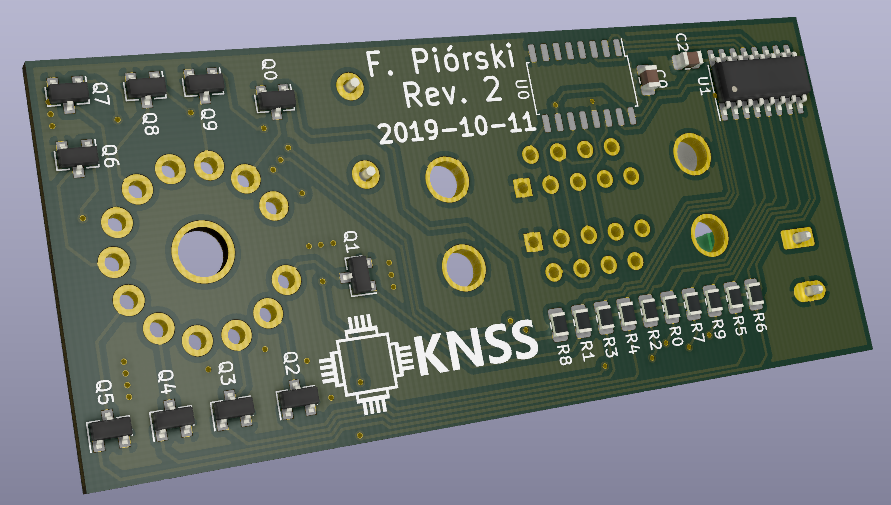

# Modular PCB for Z5730M Nixie tubes
#### Because ten small boards are better than a single big one
Schematics and board desing done in KiCad
##### ~~TODO for Rev 2:~~
* ~~Fix Z5730M footprint~~
  * ~~Widen mounting holes to account for desoldered tubes~~
  * ~~Bring mounting holes closer to center~~
* ~~Fix transistor pinout~~
  * ~~Change from Q_NPN_CBE to Q_NPN_BEC on the schematic~~
* ~~Reannotate components on the schematic~~
  * ~~Make R_n connect to Q_n and drive digit n~~
* ~~Add Rev 2 markings, of course~~

##### Revision 2 done!

